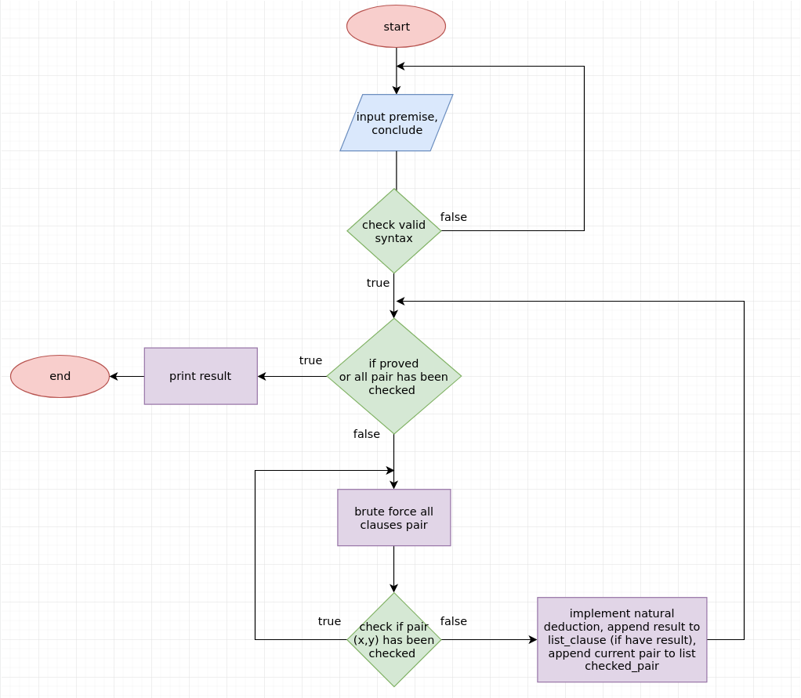
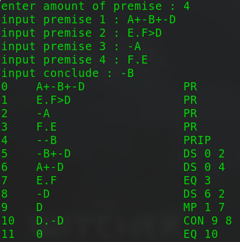
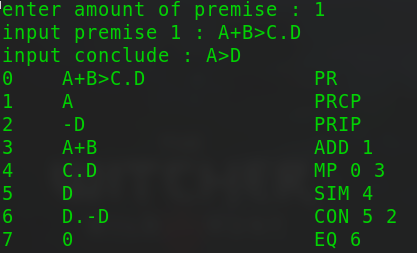

# Đồ  Án Logic Mệnh Đề

Họ tên          | Mã số sinh viên | Đóng góp | Hoàn Thành
--              |              -- | --       |--
Đoàn Khuê       |         1612311 | đồ án 2  |100%
Nguyễn Văn Linh |         1612340 | đồ án 1  |100%

---
## Mục lục

- [Đồ Án Logic Mệnh Đề](#%C4%91%E1%BB%93-%C3%A1n-logic-m%E1%BB%87nh-%C4%91%E1%BB%81)
  - [Mục lục](#m%E1%BB%A5c-l%E1%BB%A5c)
  - [Logic Và Tính Toán Vị Từ](#logic-v%C3%A0-t%C3%ADnh-to%C3%A1n-v%E1%BB%8B-t%E1%BB%AB)
    - [Giải Thuật](#gi%E1%BA%A3i-thu%E1%BA%ADt)
    - [Ý nghĩa các hàm](#%C3%BD-ngh%C4%A9a-c%C3%A1c-h%C3%A0m)
    - [Cách sử dụng](#c%C3%A1ch-s%E1%BB%AD-d%E1%BB%A5ng)
    - [Kết quả đạt được](#k%E1%BA%BFt-qu%E1%BA%A3-%C4%91%E1%BA%A1t-%C4%91%C6%B0%E1%BB%A3c)
    - [Tham Khảo](#tham-kh%E1%BA%A3o)
  - [Hợp Giải Robinson - Davis Putman](#h%E1%BB%A3p-gi%E1%BA%A3i-robinson---davis-putman)

---
## Logic Và Tính Toán Vị Từ

### Giải Thuật



### Ý nghĩa các hàm

```python
def check_clause_B_is_sub_clause_A_AND(clause_A, clause_B):
```
* Kiểm tra xem mệnh đề B (có dạng X.Y) có nằm trong mệnh đề A hay không
* Return boolen 

```python
def check_clause_B_is_sub_clause_A_OR(clause_A, clause_B):
```
* Kiểm tra xem mệnh đề B (có dạng X+Y) có nằm trong mệnh đề A hay không
* Return boolen 

```python
def check_clause_B_is_EQ_clause_A(clause_A, clause_B):
```
* Kiểm tra mệnh đề B có suy ra được mệnh đề A không
* Return boolen

```python
def nCr(n, r):
```
* Tính số lượng các cặp mệnh đề khác nhau trong danh sách
* Return số lượng các cặp mệnh đề 

```python
def negative_clause(clause):
```
* Phủ định mệnh đề
* Return mệnh đề đã được phủ định

```python
def check_valid_syntax(clause):
```
* Kiểm tra cú pháp mệnh đề có hợp lệ hay không
* Return boolen

```python
def remove_double_negative(clause):
```
*  Áp dụng luật EQ rút gọn mệnh đề có dạng phủ định của phủ định
*  Return mệnh đề đã được rút gọn

```python
def check_is_equal(clause_A, clause_B):
```
* Kiểm tra mệnh đề A có tương đương với mệnh đề B không
* Return boolen

```python
def check_is_negative(clause_A, clause_B):
```
* Kiểm tra mệnh đề A có phải là dạng phủ định của mệnh đề B không
* Return boolen

```python
def append_deduction_list(clause, proof):
```
* Thêm mệnh đề vào danh sách, cùng với dẫn chứng đã sử dụng để suy ra mệnh đề đó
* Return 

```python
def input_amount_premise():
```
* Nhập số lượng tiền đề
* Return

```python
def input_list_premise(amount_premise):
```
* Nhập các tiền đề
* Return

```python
def input_conclude():
```
* Nhập kết luận
* Return

```python
def implement_CON_rule(clause_A, clause_B, idx_A, idx_B):
```
* Áp dụng Conjunction rule cho mệnh đề  A và B 
* Return

```python
def check_HS_rule(clause_A, clause_B, idx_A, idx_B):
```
* Kiểm tra Hypothetical Syllogism rule giữa 2 mệnh đề A B, nếu tồn tại quan hệ thì áp dụng Hypothetical Syllogism rule
* Return 

```python
def natural_deduction(clause_A, clause_B, idx_A, idx_B):
```
* Hàm thực thi các luật Modus Ponens, Modus Tollens, Simplification, Addition
* Return

```python
def check_all_pair():
```
* Hàm thực hiện vòng lặp duyệt toàn bộ mệnh đề có trong danh sách
* Return

```python
def main():
```
* Hàm main của chương trình
* Return


### Cách sử dụng

* Cài đặt python
* Chạy chương trình bằng câu lệnh `python natural_deduction_logic.py`
* Nhập số lượng tiền đề
* Nhập tiền đề
* Nhập kết luận
* Chỉ sử dụng các chữ cái in hoa và các kí tự `(`, `)`, `-`, `.`, `+`, `>`, `=`

### Kết quả đạt được





### Tham Khảo

* [https://en.wikipedia.org/wiki/Natural_deduction](https://en.wikipedia.org/wiki/Natural_deduction)
* [https://www.iep.utm.edu/nat-ded/](https://www.iep.utm.edu/nat-ded/)
* [https://proofs.openlogicproject.org/](https://proofs.openlogicproject.org/)

## Hợp Giải Robinson - Davis Putman